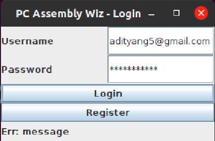

# PC Assemby wizard



## About the project

A website to quickly view and compare PC parts like CPUs, Motherboards, GPUs, etc. from across the web in one place

## How to run

Clone the repository:

```bash
git clone https://github.com/AdityaNG/PC-Assemby-wizard
git checkout OOAD
```

Create the database:

```bash
sudo -u postgres -i
# Use the full path to the everything.sql file
psql < /home/aditya/LABS/PC-Assemby-wizard/sql_gen/everything.sql
```

Compile and run the app:

```bash
make run
```

## TODO

- Login Page (Adi P)
    - Verify if username password matches
    - If yes, send to Products Page
    - If not, prompt error message
- Register Page (Akash)
    - Verify if passwords match out
    - Verify if username password does not exist
    - If yes, send to Login
    - If not, prompt error message
- Products Page (NG)
    - Display products by category
    - Add/remove product
    - Search bar
- Cart Page (NG)
    - Display products by category
    - Add/remove product
    - Show total price
- Documentation (Adi P & Akash)
    - https://docs.google.com/document/d/1VPwfcx0ekQUHAv80HxKzwxdCKOI1hbkPfNvcNvQpltw/edit